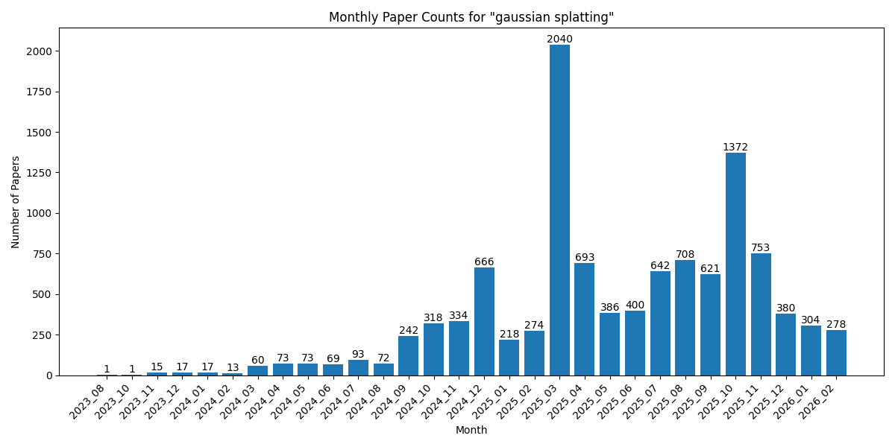
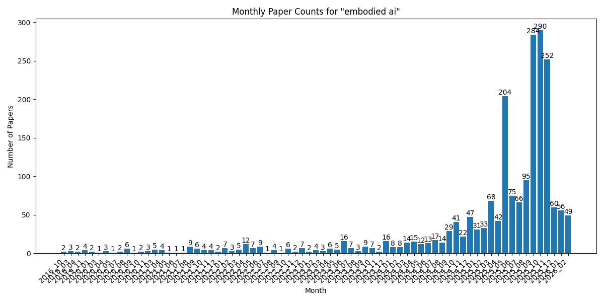
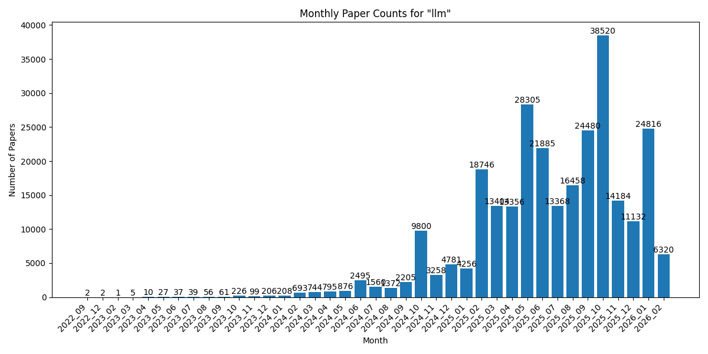

# ArXCompass - Navigating the AI Research Frontier
An intelligent system that monitors and curates cutting-edge AI research papers from arXiv, guiding you toward the most impactful discoveries.

## Features

- 🔄 **Real-time Updates**: Fresh research papers delivered daily
- 🎯 **Topic-focused**: Precisely curated for your research interests
- 📊 **Research Analytics**: Track publication trends and patterns
- 🗂️ **Smart Organization**: Papers neatly categorized by topics and dates
- 📱 **Mobile-friendly**: Access your research feed anywhere

## Quick Links

- [gaussian splatting](papers/gaussian_splatting/)
- [embodied ai](papers/embodied_ai/)
- [llm](papers/llm/)

## How to Use

1. Click 'Watch' in the top right to receive daily notifications
2. Browse papers by topic in the Quick Links section
3. View statistics and trends in each topic's README

Last update: 2026-03-02

## Statistics

| Research Topic | Total Papers | Latest Month |
| --- | --- | --- |
| gaussian splatting | 11133 | 2026_02 (278 papers) |
| embodied ai | 2058 | 2026_02 (49 papers) |
| llm | 278788 | 2026_02 (6320 papers) |

## Monthly Trends

### gaussian splatting

### embodied ai

### llm

