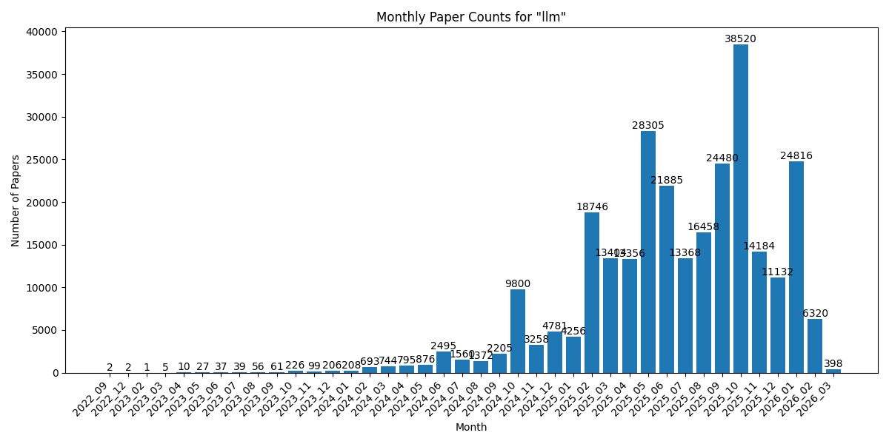

# ArXCompass - Navigating the AI Research Frontier
An intelligent system that monitors and curates cutting-edge AI research papers from arXiv, guiding you toward the most impactful discoveries.

## Keywords

- [gaussian splatting](gaussian_splatting/)
- [embodied ai](embodied_ai/)
- [llm](llm/)

Last update: 2025-04-27

## Statistics

| Research Topic | Total Papers | Latest Month |
| --- | --- | --- |
| gaussian splatting | 3723 | 2025_04 (354 papers) |
| embodied ai | 378 | 2025_04 (23 papers) |
| llm | 70550 | 2025_04 (7803 papers) |

## Monthly Trends

### gaussian splatting

### embodied ai

### llm

