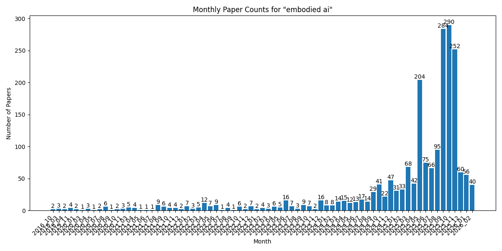

# Statistics for embodied ai

[Home](https://arxcompass.github.io) - [Papers](https://arxcompass.github.io/papers) - [embodied ai](https://arxcompass.github.io/papers/embodied_ai)

## Overall Statistics

- Total number of papers: 1961
- Number of months tracked: 72
- Average papers per month: 27.2

## Monthly Trends

## Monthly Breakdown

| Month | Paper Count | Percentage of Total |
| --- | --- | --- |
| [2026_01](./2026_01/papers_1.md) | 8 | 0.4% |
| [2025_12](./2025_12/papers_1.md) | 60 | 3.1% |
| [2025_11](./2025_11/papers_1.md) | 252 | 12.9% |
| [2025_10](./2025_10/papers_1.md) | 290 | 14.8% |
| [2025_09](./2025_09/papers_1.md) | 284 | 14.5% |
| [2025_08](./2025_08/papers_1.md) | 95 | 4.8% |
| [2025_07](./2025_07/papers_1.md) | 66 | 3.4% |
| [2025_06](./2025_06/papers_1.md) | 75 | 3.8% |
| [2025_05](./2025_05/papers_1.md) | 204 | 10.4% |
| [2025_04](./2025_04/papers_1.md) | 42 | 2.1% |
| [2025_03](./2025_03/papers_1.md) | 68 | 3.5% |
| [2025_02](./2025_02/papers_1.md) | 33 | 1.7% |
| [2025_01](./2025_01/papers_1.md) | 31 | 1.6% |
| [2024_12](./2024_12/papers_1.md) | 47 | 2.4% |
| [2024_11](./2024_11/papers_1.md) | 22 | 1.1% |
| [2024_10](./2024_10/papers_1.md) | 41 | 2.1% |
| [2024_09](./2024_09/papers_1.md) | 29 | 1.5% |
| [2024_08](./2024_08/papers_1.md) | 14 | 0.7% |
| [2024_07](./2024_07/papers_1.md) | 17 | 0.9% |
| [2024_06](./2024_06/papers_1.md) | 13 | 0.7% |
| [2024_05](./2024_05/papers_1.md) | 12 | 0.6% |
| [2024_04](./2024_04/papers_1.md) | 15 | 0.8% |
| [2024_03](./2024_03/papers_1.md) | 14 | 0.7% |
| [2024_02](./2024_02/papers_1.md) | 8 | 0.4% |
| [2024_01](./2024_01/papers_1.md) | 8 | 0.4% |
| [2023_12](./2023_12/papers_1.md) | 16 | 0.8% |
| [2023_11](./2023_11/papers_1.md) | 2 | 0.1% |
| [2023_10](./2023_10/papers_1.md) | 7 | 0.4% |
| [2023_09](./2023_09/papers_1.md) | 9 | 0.5% |
| [2023_08](./2023_08/papers_1.md) | 3 | 0.2% |
| [2023_07](./2023_07/papers_1.md) | 7 | 0.4% |
| [2023_06](./2023_06/papers_1.md) | 16 | 0.8% |
| [2023_05](./2023_05/papers_1.md) | 5 | 0.3% |
| [2023_04](./2023_04/papers_1.md) | 6 | 0.3% |
| [2023_03](./2023_03/papers_1.md) | 3 | 0.2% |
| [2023_02](./2023_02/papers_1.md) | 4 | 0.2% |
| [2023_01](./2023_01/papers_1.md) | 2 | 0.1% |
| [2022_12](./2022_12/papers_1.md) | 7 | 0.4% |
| [2022_11](./2022_11/papers_1.md) | 2 | 0.1% |
| [2022_10](./2022_10/papers_1.md) | 6 | 0.3% |
| [2022_09](./2022_09/papers_1.md) | 1 | 0.1% |
| [2022_08](./2022_08/papers_1.md) | 4 | 0.2% |
| [2022_07](./2022_07/papers_1.md) | 1 | 0.1% |
| [2022_06](./2022_06/papers_1.md) | 9 | 0.5% |
| [2022_05](./2022_05/papers_1.md) | 7 | 0.4% |
| [2022_04](./2022_04/papers_1.md) | 12 | 0.6% |
| [2022_03](./2022_03/papers_1.md) | 5 | 0.3% |
| [2022_02](./2022_02/papers_1.md) | 3 | 0.2% |
| [2022_01](./2022_01/papers_1.md) | 7 | 0.4% |
| [2021_12](./2021_12/papers_1.md) | 2 | 0.1% |
| [2021_11](./2021_11/papers_1.md) | 4 | 0.2% |
| [2021_10](./2021_10/papers_1.md) | 4 | 0.2% |
| [2021_09](./2021_09/papers_1.md) | 6 | 0.3% |
| [2021_08](./2021_08/papers_1.md) | 9 | 0.5% |
| [2021_07](./2021_07/papers_1.md) | 1 | 0.1% |
| [2021_06](./2021_06/papers_1.md) | 1 | 0.1% |
| [2021_05](./2021_05/papers_1.md) | 1 | 0.1% |
| [2021_04](./2021_04/papers_1.md) | 4 | 0.2% |
| [2021_03](./2021_03/papers_1.md) | 5 | 0.3% |
| [2020_11](./2020_11/papers_1.md) | 3 | 0.2% |
| [2020_10](./2020_10/papers_1.md) | 2 | 0.1% |
| [2020_09](./2020_09/papers_1.md) | 1 | 0.1% |
| [2020_08](./2020_08/papers_1.md) | 6 | 0.3% |
| [2020_07](./2020_07/papers_1.md) | 2 | 0.1% |
| [2020_05](./2020_05/papers_1.md) | 1 | 0.1% |
| [2020_04](./2020_04/papers_1.md) | 3 | 0.2% |
| [2020_03](./2020_03/papers_1.md) | 1 | 0.1% |
| [2020_01](./2020_01/papers_1.md) | 2 | 0.1% |
| [2019_11](./2019_11/papers_1.md) | 4 | 0.2% |
| [2018_04](./2018_04/papers_1.md) | 2 | 0.1% |
| [2018_03](./2018_03/papers_1.md) | 3 | 0.2% |
| [2016_10](./2016_10/papers_1.md) | 2 | 0.1% |
