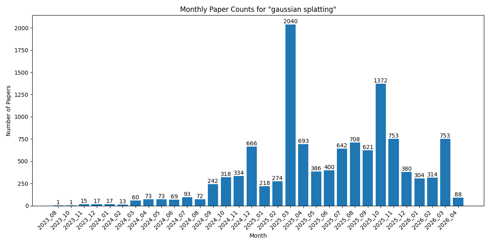

# Statistics for gaussian splatting

[Home](https://arxcompass.github.io) - [Papers](https://arxcompass.github.io/papers) - [gaussian splatting](https://arxcompass.github.io/papers/gaussian_splatting)

## Overall Statistics

- Total number of papers: 3978
- Number of months tracked: 20
- Average papers per month: 198.9

## Monthly Trends

## Monthly Breakdown

| Month | Paper Count | Percentage of Total |
| --- | --- | --- |
| [2025_04](./2025_04/papers_1.md) | 609 | 15.3% |
| [2025_03](./2025_03/papers_1.md) | 1460 | 36.7% |
| [2025_02](./2025_02/papers_1.md) | 244 | 6.1% |
| [2025_01](./2025_01/papers_1.md) | 95 | 2.4% |
| [2024_12](./2024_12/papers_1.md) | 394 | 9.9% |
| [2024_11](./2024_11/papers_1.md) | 292 | 7.3% |
| [2024_10](./2024_10/papers_1.md) | 270 | 6.8% |
| [2024_09](./2024_09/papers_1.md) | 210 | 5.3% |
| [2024_08](./2024_08/papers_1.md) | 60 | 1.5% |
| [2024_07](./2024_07/papers_1.md) | 81 | 2.0% |
| [2024_06](./2024_06/papers_1.md) | 57 | 1.4% |
| [2024_05](./2024_05/papers_1.md) | 59 | 1.5% |
| [2024_04](./2024_04/papers_1.md) | 49 | 1.2% |
| [2024_03](./2024_03/papers_1.md) | 48 | 1.2% |
| [2024_02](./2024_02/papers_1.md) | 11 | 0.3% |
| [2024_01](./2024_01/papers_1.md) | 11 | 0.3% |
| [2023_12](./2023_12/papers_1.md) | 15 | 0.4% |
| [2023_11](./2023_11/papers_1.md) | 11 | 0.3% |
| [2023_10](./2023_10/papers_1.md) | 1 | 0.0% |
| [2023_08](./2023_08/papers_1.md) | 1 | 0.0% |
